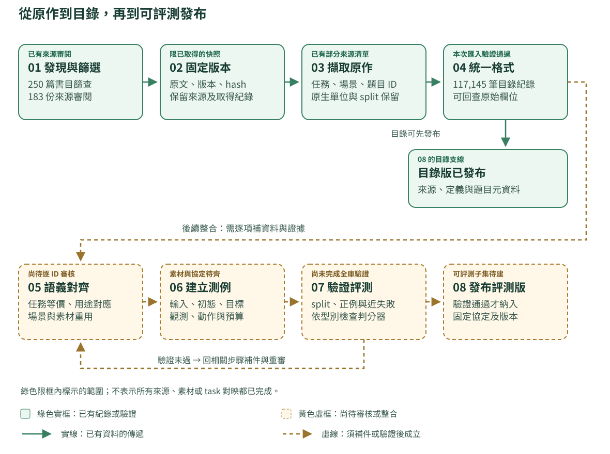
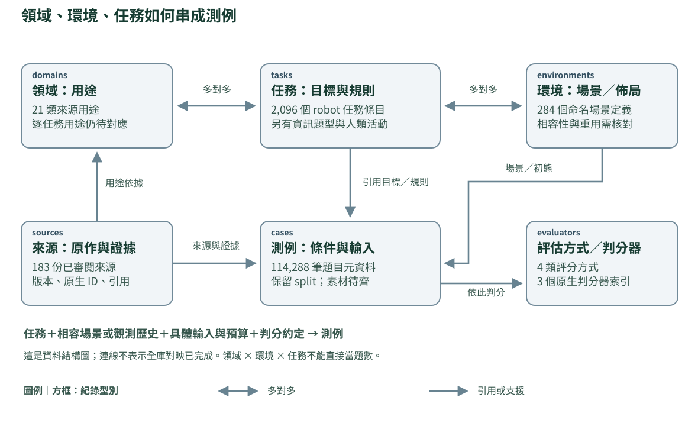
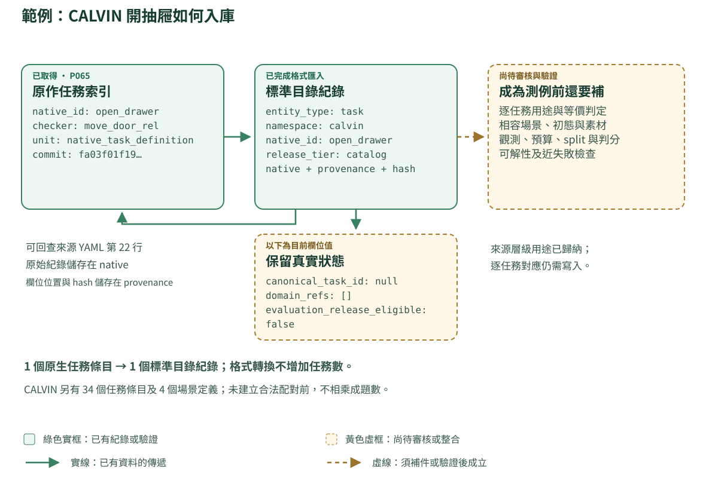

# 標準化蒐集與整合流程

Pipeline 規格 0.1 · 2026-10-08。用途分類沿用 domains-0.11；本文件沒有新增領域、修改既有規模實數或恢復舊配額。

## 三分鐘了解整體

建立一條可重跑、可追溯的資料生產線：找來源 → 固定版本 → 擷取原作紀錄 → 統一欄位 → 對齊領域、環境與任務 → 驗證素材與判分 → 發布目錄及可評測子集。每一步都留下輸入、輸出、失敗原因與版本。

對外維持五項：**領域、環境、任務、題數、評估方式**。背後加上來源、檔案與關係紀錄，支援追溯及去重。來源層級的用途分類，與逐任務的用途對應，分開驗收。

**統一的核心是身份、欄位語義、關係和驗證規則。** 影片可保留影片格式，robot episodes 可保留 RLDS／LeRobot，相同介面透過 adapter 讀取。機器人的動作空間、感測、物理與判分条件仍必須明確描述。

先用兩個案例理解流程：CALVIN「把抽屜拉開」從原作目標與 checker 走到可評測操作題；OpenEQA「辨認電視上方物體」從題目、觀測引用與參考答案走到問答評測。每一步都列出拿到什麼、怎麼處理、留下什麼及目前進度。網站可逐步切換，完整文字另見[兩個案例的八步講解](WORKED_EXAMPLES.md)。兩例的後半段說明尚待完成的工作，沒有新增模型成績或可評測題數。



圖例：綠色實框表示本次已有的紀錄或驗證，範圍以框內文字為準；黃色虛框表示尚待審核或整合。實線傳遞已有資料，虛線需要補齊條件。目錄可以先發布，可評測版需要逐項通過後續檢查。

## 01　整條流程：每一步交付什麼

| 步驟 | 輸入與操作 | 標準輸出 | 通過條件 |
|---|---|---|---|
| 1. 發現與篩選 | 檢索論文、官方程式庫與資料頁；追查引用、父資料及衍生集合 | discovery log、來源登記、納入／排除理由 | 每筆有找到的日期與途徑；同篇不同版本、方法論文與資料來源分開 |
| 2. 固定來源版本 | 取得 PDF、補充資料、程式、task／scene 清單、split、標註、判分定義及資產索引 | source manifest、file receipts、依賴清單 | commit／release／檔案 hash 可定位；下載失敗、未公開及需申請者都有紀錄 |
| 3. 擷取原作紀錄 | 按原生 ID 擷取 task、scene、episode、QA、clip、活動與數量宣稱 | native records；每個值附頁碼、表格、JSON pointer 或程式位置 | 保留原文、原生單位、split、版本；無法取得的欄位用 null 加原因 |
| 4. 格式標準化 | 將各來源映射到共同欄位；保留原始 payload 和格式特有欄位 | schema-valid catalog、檔案與時間／座標／單位描述 | schema、身份唯一性、引用、原始值保留與轉換紀錄檢查通過 |
| 5. 語義對齊 | 依目標、對象、必要過程與完成條件對齊任務；核對場景重用 | task↔domain、task↔environment、source-task↔canonical-task 對照及判定紀錄 | 合併有證據；不同、衍生及待決可查；原作紀錄不被覆蓋 |
| 6. 素材與題目建置 | 取得可用素材，建立觀測／輸出／初態／預算／判分約定 | 有完整依賴的 case manifest、每類輸出的 adapter | 輸入和答案／判分可取得；缺少必要資產或合法存取權的 case 不進可評測發布 |
| 7. 切分與評測驗證 | 查跨來源重疊，凍結 split，檢查正常解與近失敗，執行小批重現 | split manifest、驗證報告、版本固定的 evaluator、證據 | 依評測類型通過適用檢查；每個發布 case 的依賴完整；不把 smoke test 當全部可解 |
| 8. 發布與增量更新 | 從登記資料重算比較表、coverage、缺口、下載清單與差異 | catalog release、evaluation release、網站、JSONL／Parquet、版本差異 | 每個數字有單位／範圍／分母；相同輸入與 adapter 可重建；新版本不悄悄覆寫舊版 |

第 4 步完成表示格式已整理。第 5 步完成表示跨來源任務／環境關係已有審核。第 7 步才建立可評測發布的證據。三者分開報數。

## 02　怎麼有系統地「蒐集全部」

將「全部」寫成可審核的搜尋範圍：截止日期、搜尋平台、query、研究範圍、納入規則及已追查的引用鏈。新增來源進同一個 queue。定期重跑搜尋並公布新增、排除及無法取得的來源；不以目前 183 份表示全球全集。

本版可用五組搜尋入口覆蓋不同資料形態：人類活動／VLOG／身體攝影機／Ego；理解與預測；機器人操作與柔性物；導航、協作與恢復；通用資料、世界模型及評測方法。這些是檢索分工，不增加首頁用途分類。

| 每份來源要找的東西 | 最低紀錄 |
|---|---|
| 身份 | work ID、論文版本、benchmark／dataset release、程式 commit、日期 |
| 原生定義 | 任務 ID、場景 ID、活動／題型、初態／生成規則、完成條件 |
| 資料清單 | episode／question／clip ID、split、媒體／軌跡／標註位置、檔案 hash |
| 評測 | 原生 metric、分母、觀測／動作約定、成功 checker／答案／評審 rubric |
| 重用關係 | 父資料、使用子集、scene／asset／video／trajectory 是否共用 |
| 存取 | code、annotation、video、3D asset 各自的授權／存取狀態；能否下載、轉換、再散布 |
| 完整性 | 應取得範圍、已取得範圍、缺失原因、原文數字與清單數字的差異 |

資料量大時先取得 manifests、定義與標註索引，再排程影片、軌跡及資產下載。不能下載的來源仍能進 survey 目錄，以引用、官方 fetch 指令和缺口維持可追蹤性。

## 03　共同資料模型：六種紀錄支援五欄介面



圖中連線說明資料結構，並不宣稱全庫逐 ID 對應已完成。來源、場景、任務、題目與判分索引各有單位，不能沿箭頭相乘。影片／問答測例可引用觀測歷史，不必有可互動的模擬場景。

| 紀錄 | 它代表什麼 | 核心欄位 |
|---|---|---|
| sources | 一份已辨識、固定版本的來源及其審閱 | source ID、原文／資料／code 引用、原生數量、scope、來源關係、用途證據 |
| domains | 本庫的用途分類定義 | domain ID、名稱、定義、納入／排除範圍、taxonomy version |
| environments | 有身份的互動場景／layout | native scene ID、來源版本、asset／生成規則、物理或模擬、重用／等價關係 |
| tasks | 原生任務定義或經審核的共同任務 | 原生單位、來源、目標、對象、必要過程、限制、完成條件、domain 對應 |
| cases | 具有輸入、條件和判分約定的單題 | case ID、task／goal 引用、environment 或 observation context、split、初態、輸入、預算、evaluator |
| evaluators | 具體的判分實作／約定 | 評分類型、metric／公式、所需證據、版本、閾值、分母、驗證狀態 |

來源 manifest、asset index、relations、reviews、conversion log、runs 是工程紀錄。它們不增加一組與五欄競爭的分類軸。

同一個 tasks 集合容納原生 robot 任務、資訊題型及人類活動時，必須以 task_kind 分項統計。標準化之前的 task labels 不能被命名為已去重的 canonical robot tasks。

關係的整理方式：

- task → 一個或多個用途 domain；記用途判定的任務證據。
- task ↔ 可支援該任務的 environment；相容性由定義或驗證支持。
- case → 適用的 task 定義或原生 goal program、具體 environment／觀測歷史及 evaluator。
- source record → canonical task／environment；保留 exact、equivalent、derived、distinct、unresolved 的判定與理由。
- artifact → source／parent artifact；保留同源影片、clip、物件 mesh、房屋、示範與衍生標註關係。

影片的錄製地點或 observation-history ID 使用 context 欄位。只有取得相應互動場景身份及規格，才建立 environment 關聯。

## 04　每筆都需要的共同外框

目前提供的 catalog_record.schema.json 是**目錄匯入規格**。它驗證六種紀錄的結構，保留原始 payload，且刻意不允許將它們標記為可評測發布。後續 semantic／evaluation 規格以明確 migration 擴充，不能直接修改一個布林值來跳過驗證。

| 欄位 | 定義 |
|---|---|
| schema_version | 共同格式版本，例如 collection-catalog-0.1 |
| entity_type | source／domain／environment／task／case／evaluator |
| identity | namespace、native_id、revision、partition；保留來源身份 |
| id | entity_type 與 identity 的確定性 SHA-256；不是任務語義 hash |
| source_refs | 對應的已登記來源；允許多來源支持同一項資產或定義 |
| provenance | 讀取的快照路徑、檔案 hash、JSON pointer／行號、adapter 版本 |
| data | 統一命名、明確型別的欄位 |
| native | 完整保留匯入的原始紀錄 |
| native_sha256 | 原始紀錄的 canonical-JSON hash；用於檢查保留與 round trip |
| release_tier | 本版固定 catalog |
| evaluation_release_eligible | 本版固定 false；是否可評測由後續完整證據決定 |

底層原作 PDF、JSON、YAML、影片仍需獨立的原始檔案 hash。匯入快照 hash 不等於已驗證所有上游資料 bytes。本版報告會明列這個限制。

來源 ID、dataset revision、taxonomy version、adapter version、evaluator version、benchmark release 各自保存。繁體與簡體是同一筆紀錄的顯示文字，ID、單位及程式欄位不做翻譯。

## 05　不同類型資料的額外欄位與格式

| 資料形態 | 必須保留的資訊 | 建議儲存及交換 |
|---|---|---|
| 人類影片、VLOG、頭戴／身體攝影機 | parent video／clip ID、攝影機位置、時間段、音訊／視角同步、動作與對象標註、split 分組單位 | 原始影片／音訊＋JSONL 或 Parquet 標註；Ego4D 等原生欄位保留 |
| 問答與理解 | question ID、觀測歷史／圖片引用、問題、參考答案、可接受答案／rubric、允許讀取的資訊截止點 | JSONL／Parquet；答案與評分資源可獨立封存 |
| 預測 | context 起訖、prediction anchor、未來 horizon、目標型別、可見性 mask、frame／時間座標、真實未來引用 | 時序資料＋JSONL／Parquet；禁止把未來標註混入模型輸入 |
| 機器人示範／控制軌跡 | episode／step、robot embodiment、camera、state、action、reward（若有）、成功、terminal／truncation、時間及單位 | 原生 RLDS／LeRobot；依輸出需求轉成已驗證的對應格式 |
| 互動場景與任務定義 | simulator／版本、scene／object asset ID、mesh／材料、初態或生成器、機體／感測／控制、goal／過程 checker | 原生 USD／MJCF／URDF／YAML／BDDL 等＋共同 manifest |
| 協作、恢復與工具互動 | agent／tool 身份、角色、事件、介入時刻、可見資訊、工具結果、代價及中間步驟限制 | 有時間戳的 event／trajectory log＋case contract |

控制軌跡特別記錄 action 是位置、速度、力矩還是增量；絕對／相對座標、參考 frame、旋轉排列及單位都要明示。缺少轉換所需資訊時保留 native，標示無法安全轉換。人類手部軌跡不自動視為機器人的可執行 action。

時間標準化保留原始 timebase 與 timestamps；若生成秒制欄位，保存 offset、rate、同步誤差及換算方法。視訊如為可變 frame rate，不用單一平均 FPS 取代原始時間戳。重採樣、裁切、壓縮、座標變換的輸出都記 parent hash 及參數。

每次轉換保存四件事：原始表示、共同表示、轉換方法／版本、是否有資訊損失及驗證結果。沒有對應標註的欄位維持 null 與原因。

## 06　語義對齊與去重：先定義判定單位

| 判定 | 需要比對 | 不足以決定的依據 |
|---|---|---|
| 同一來源紀錄 | namespace、版本、原生 ID、原生 partition | 只有相同的數字 ID |
| 同一個檔案或素材 | 原始 bytes hash、父素材與轉換／裁切記錄 | 相同下載名稱；同 clip 的不同轉碼 hash |
| 同一環境 | 場景身份、布局／幾何、資產版本、生成規則、重用關係 | 都叫 kitchen；使用相同 simulator |
| 等價任務 | 對象角色、目標、必要過程、限制及完成條件；核對容差差異 | 同名、文字 embedding 相似、同一份 YAML |
| 衍生任務／規則 | parent task、增加或修改的目標／過程／限制、差異與判分 | 只換顏色、相機、位置或 policy seed |
| 同源測例 | 原始 episode／video／case、初態、輸入時間段及衍生關係 | 字面題目不同；重新翻譯或重命名 |

候選比對可以先用名稱、語義檢索、物件／predicate 和來源血緣縮小範圍，再審核。自動化只在身份與可驗證的原生關係上作確定判斷；跨來源的語義等價另留下 reviewer、依據與判定版本。

來源被歸為「餐飲、居家」不代表它的每個 task 同時屬於兩者。逐任務用途仍按任務目標與對象歸納；在尚未審核時，以 pending 表示進度，補齊後才能進已完成的任務用途分布。

equivalent、derived、distinct、unresolved 不能混用。相似任務但判分容差不同，可共享 base-task 群組，同時保留兩個 rule specification；比較時各自報 base-task 數與規格數。沒有可對齊的完成條件，不先合併。

可加入新的目標、必要順序、精度、恢復或工具規則，但必須記 parent、delta、可解性與新 evaluator。把影片轉成模擬操作任務需要場景、物件、控制與成功條件的建置，不是轉換檔案格式就完成。

## 07　品質檢查與人工審核

| 檢查 | 可自動做什麼 | 需要人或實際執行確認什麼 |
|---|---|---|
| 檔案與結構 | 檔案完整性、hash、schema、型別、ID 唯一性、引用及空值原因 | 原作本身缺什麼、不同版本是否矛盾 |
| 數量 | 按原生 unit／split 重算、對比聲稱數字、標示 mini／subset | 1000 個活動與 1016 個程式目錄差異的意義 |
| 時空與動作 | timestamp 單調、episode 邊界、shape、單位、frame 及轉換測試 | 感測／動作語義及轉換是否符合原生系統 |
| 用途與任務 | 提議標籤、找相似 task、生成 evidence checklist | 用途、等價／衍生、過程限制及判分是否保持語義 |
| 切分 | 相同 ID／hash／lineage group 的跨 split 交集 | 未知父影片／示範、近重複、家庭／人物／房屋身份 |
| 判分 | 格式、成功／失败樣例、边界值、确定性／隨機誤差 | 正常合法解是否被接受、近失敗是否誤過、是否可作弊 |

每筆語義判定至少一位 reviewer；所有跨來源任務合併與有歧義的規則差異安排第二位 reviewer 或獨立仲裁。其他自動抽取結果按來源與資料型態分層抽查；抽查數、錯誤數及修正結果公開。這是建議的後續審核政策，目前來源分類不宣稱已完成雙人一致性驗證。

LLM 可讀取文字、提出 schema 欄位及候選映射。每個提議附原文定位、模型／prompt 版本與 proposed 狀態。LLM 的「信心分數」不能替代來源、人工判定或物理驗證；禁止靠推測填入未公布的題數、split 或成功條件。

機器檢查失敗的紀錄進 quarantine，保存原因。schema 可接受且清楚註明缺失的目錄紀錄可以發布；語義未決或素材不足者不進相應的完成量。所有發布數量都從狀態和 ID 清單計算。

## 08　題目、split 與評測發布

每個正式 case 需要明確的 task／goal、environment 或 observation context、物件／材料／初態、可見資訊、輸出格式、時間／動作／工具預算、適用 evaluator、來源與 split。示範或影片中的一個 episode 只有滿足相關評測約定，才會成為本庫可評測題。

保留 native_split 以重現前作。若設計 unified_split，另外保存 assignment、理由及固定版本，不能覆寫原生 split。來源把資料稱為 train 時，不能將它算入原作 test 題數；新的測試用途須清楚說明污染風險與協定。

| 分組層次 | 適用的切分目標 |
|---|---|
| parent video、錄製 session、原始 trajectory、同初態 | 防止同源片段／衍生 QA 分到兩側 |
| 參與者、家庭、場地、相同房屋／幾何環境 | 評估跨人、跨場景泛化；只在身份可查時主張 |
| base task、規則版本、組合中的子任務 | 評估新任務或新組合；明示訓練是否見過子任務 |
| 父 dataset、衍生集合、曾公開的 eval 素材 | 檢查跨 benchmark 重用及預訓練污染；未知部分另列 |

不能所有 split 都一律按「整個 task family」切；那會改變原作評測目標。先區分 seen-task／unseen-environment、unseen-task 等 track，再定義各自禁止跨側的關係。

判分保留四大類：標準答案比對、數值誤差／相似度、環境狀態／過程、人工／模型評審。每個 evaluator 仍需要自己的版本、metric、閾值、分母及適用條件。accuracy、成功率、ADE 和主觀評分不直接平均成同一個數值。

共同發布條件包含輸入可解析、依賴完整、目標可驗證、evaluator 已接受正例及拒絕相關近失敗、split 檢查和 protocol 固定。離線 QA／預測不要求跑機器人；互動控制則需要 reset、step、觀測／動作與判分的相容檢查。官方 eval server 的隱藏標籤可透過正式服務評分，不必強求本地取得答案。

可載入、可評分、已證明可解及已有 baseline 結果分開紀錄。幾道 smoke test 通過不表示全部 case 都有合法解。要報告整體可解率，需提供逐題證據或明示抽樣設計與不確定性。

## 09　儲存、adapter 介面與增量更新

建議先用原始檔案／物件儲存保存素材，JSONL 保存可審閱紀錄，SQLite 或 DuckDB 建立查詢視圖；資料量增加後將長表／時序輸出為 Parquet。網站、CSV、報告及規模數字由同一份 registry 產生。

以下是部署目錄示意，不表示目前已取得全部內容：

```text
collection/
  discovery/       queries, candidate sources, inclusion decisions
  raw/             immutable source files, manifests, receipts
  native/          extracted records in original units
  catalog/         sources, domains, environments, tasks, cases, evaluators
  mappings/        equivalence, derivation, task-domain, task-environment
  assets/          media/trajectory/scene references and dependency status
  reviews/         evidence, decisions, disagreements, quarantine
  releases/        frozen catalog/evaluation manifests and count reports
```

每個原生 adapter 實作相同的操作：discover_resources、fetch_manifest、extract_records、normalize、validate_native、export_catalog。可執行 adapter 另實作 load_case、observe／step 或離線 predict、evaluate、collect_evidence。資料蒐集不依賴先跑 simulator。

job identity 使用來源版本、輸入 hashes、adapter 版本與設定的組合。成功快照不覆寫；下載可續傳、失敗可重試、同樣輸入可略過已完成步驟。每個來源一個 job，報 queue、in progress、complete、partial、blocked 及具體原因。

新版本先生成 added／changed／removed 差異。變動的資產、任務、判分器會使受影響的 mapping／case 驗證失效，安排重審。刪除來源以 tombstone 保留血緣，不把舊結果的來源擦掉。

Catalog release 發布來源、定義、可散布的元資料及缺口；Evaluation release 發布固定協定、依賴完整且經相應驗證的 case 子集。受限原始素材使用取得指引或引用；GitHub Pages 放文件和小型查詢資料，影片／大型場景透過資料儲存服務管理。

## 10　每次重算的規模與 coverage

| 主欄位 | 來源層級 | 已收集 | 整合後／可評測 |
|---|---|---|---|
| 領域 | 有來源支持的用途類別與 source-domain links | 有 task-domain 判定的任務數／適用任務分母 | 有可評 case 支持的領域；未完成映射不推定為沒有覆蓋 |
| 環境 | 原作宣稱量，保留 layout／location／style 等單位 | 有版本和身份的原生場景定義 | 審核後獨立環境數、已取得資產量、可載入量分開 |
| 任務 | 作者公布 tasks／skills／labels／activities | 逐 native ID 任務、資訊題型、人類活動分項 | 已審核的 base-task 聯集、規則規格、仍待決量 |
| 題數 | 作者報告量及 train／val／test 範圍 | 有 manifest 的元資料、輸入素材完整量 | 按 kind／split 的可評 case、已有結果量及已知同源群組 |
| 評估方式 | 四種方法標籤及來源數 | 有原生公式／code／rubric 的評分器索引 | 完成接線和驗證的 evaluator 數及適用 case 數 |

來源 coverage 必須區分「183 份都審閱」與「多少份已取得至少一個 task」「多少份的完整 task manifest 已核對」。分母僅包括適用來源；來源沒有互動環境時用 not_applicable，尚未查明時用 unknown。

**任務聯集數需要語義對齊才能得到。** 去重未完成時報已確認的群組數、已確認不同的任務數及待決數；若未能證明群組彼此不同，連下界也不任意填入。原作數字可在逐來源表比較，但不直接加成全球總題數。

## 11　目前已跑的參考匯入與未完成部分



實例取自本庫已匯入的 CALVIN open_drawer 紀錄，保留原生 ID、move_door_rel checker 引用、來源版本和位置。圖中 null、空用途列表與 false 是目前目錄的實際欄位值，不表示原作缺少用途或成功定義。來源層級用途已歸納，逐任務對應與可評測整合仍待完成。

本版 run_snapshot.py 讀取現有固定快照，以六種共同紀錄匯出 JSONL.gz，建立有外鍵的 SQLite 查詢庫，保存 input manifest、示例和報告。它不下載新影片、不轉換控制軌跡、不產生新任務、不執行模型。

輸入包含 183 份原作審閱與 21 類用途、284 個原生場景定義、2,096 個 robot 任務來源、7 個資訊題型、263 個人類程序活動、114,288 筆 case 元資料及 3 個原生 evaluator 索引。不同任務型別各自報數；3 個 evaluator 索引不等於 3 個已重現的判分器，也不等於四種方法類型。

本版檢查 schema、ID 唯一性、外鍵、快照 hashes、原始 payload 保留及壓縮輸出 round trip。它讓原本分散的資料可用同一格式查詢；跨來源語義對齊、全部素材、共同 split 與可執行評測仍未完成。

具體例子：CALVIN 的 34 個原生 task 定義、4 個原生 scene 定義和 checker 引用可進同一目錄；不能由此直接產生 34×4 題。所有 task 共用一份 YAML 的 hash，仍有 34 個不同原生 ID；檔案 hash 不是 task 等價證據。OpenEQA 的 observation-history ID 保留為觀測引用，不轉成新的互動場景。

執行方式（在網站 repository 根目錄；需 Python 3.9 以上）：

```sh
python3 -m venv .preview/collection-venv
.preview/collection-venv/bin/python -m pip install -r benchmark/collection/requirements.txt
.preview/collection-venv/bin/python -m unittest discover -s benchmark/collection -p 'test_catalog.py' -v
.preview/collection-venv/bin/python benchmark/collection/run_snapshot.py --out .preview/collection-run-001
```

輸出目錄必須是新的空目錄。只有全部檢查通過才寫 SUCCESS.json；catalog 匯入通過不等於 evaluation release 通過。報告中的 0 可評題只描述這次元資料匯入，不撤銷其他工程附錄中的既有模擬實驗。

## 12　往完整生產線推進的交付順序

| 交付 | 工作範圍 | 驗收 |
|---|---|---|
| A. 共同契約與快照匯入 | 本版 schema、來源 ID、已有清單的 adapter、報告、反例檢查 | 現有紀錄可重算、原始值可還原、未知與待整合保留 |
| B. 183 份來源的取得矩陣 | 對每份列出 task／scene／case manifest、素材、評分與存取狀態 | 每個欄位有實際位置或明確缺口；報至少一筆與完整清單兩種 coverage |
| C. 五種資料形態的 adapter 契約 | 影片／標註、QA、預測、軌跡、場景／goal；先處理已有格式與互补来源 | 代表性來源的輸入／標註／時間／單位不丟失；新增 adapter 有驗證樣本 |
| D. 逐任务／環境對齊 | 建立來源 task 聯集、用途與環境關係、規則差異、重用清單 | 獨立任務與衍生規格可查；每次合併有依據；分項 coverage 可重算 |
| E. 首批可評測發布 | 按資料可取得性和不同評測形態選子集，接通 evaluator 與固定協定 | 依賴、split、正例／近失敗、可解性範圍、baseline 證據逐項清楚 |
| F. 自動更新與論文表格 | 新來源和版本差異自動進 queue，從 registry 輸出比較、分布與缺口 | 所有公開數字回到 ID 清單；原作量、收集量與已驗證量分欄 |

Mac 可先完成目錄、標註、schema、去重候選和多數來源工程。需要特殊 simulator 或大量 GPU 的驗證交由具備條件的 worker，來源蒐集不因此縮小範圍。本版不預設「多少來源乘多少變化」作為規模目標。

## 13　採用哪些既有標準

以下根據 2026-10-08 讀取的官方文件。完整 URL、讀取時間與文件 hash 保存在 references.json；這些是格式設計依據，並不新增本庫的 benchmark 來源数。

| 依據 | 官方格式提供什麼 | 本計畫如何使用 |
|---|---|---|
| RLDS | episode／step 結構、is_first／is_last／is_terminal、episode metadata；末步欄位的有效性有明確語義 | 保留控制時序及 episode 邊界；避免把 terminal 和截斷混淆 |
| Open X-Embodiment | 原生集合以 RLDS episode 格式表示 | 借用 episode 交換層；跨來源任務等價、場景和評測條件仍須另外對齊 |
| LeRobotDataset v3.0 | Parquet 時序、MP4 視訊、feature／FPS metadata，以及跨檔案的 episode 邊界索引 | 作為適用 robot trajectory 的儲存／讀取格式；不能以一個檔案代表一個 episode |
| Ego4D Annotation Schemas | video_uid／clip_uid、原片與片段時間、依子 benchmark 定義的標註 | 保留影片血緣、時段和子任務欄位；不直接改寫成 robot actions |
| BEHAVIOR-1K BDDL | objects、init、goal 與 simulator backend 的表示；goal 定義本身以完成狀態為主 | 保留原生 goal；必要順序或恢復規則另外建模並接過程 checker |
| MLCommons Croissant 1.0 | FileObject／FileSet、RecordSet／Field 及檔案與欄位關係的資料描述 | 規劃未來的公開 dataset metadata export；本版尚未宣稱 Croissant 相容驗證 |
| JSON Schema Draft 2020-12 | 可機器檢查的資料結構與條件約束 | 驗證共同 catalog 契約；物理可解性及語義等價仍由另外的驗證處理 |
